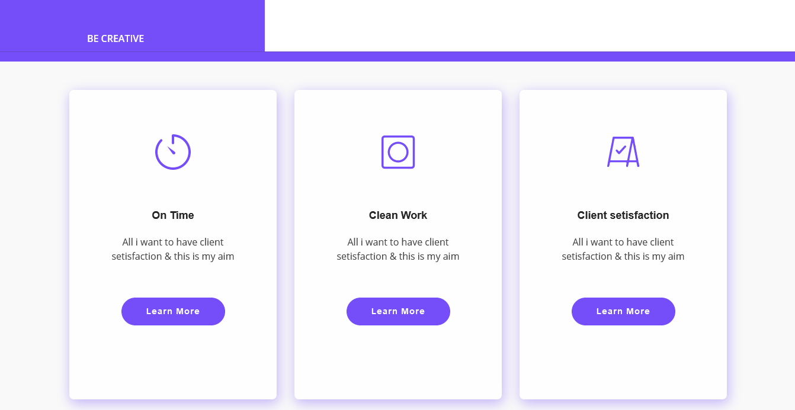
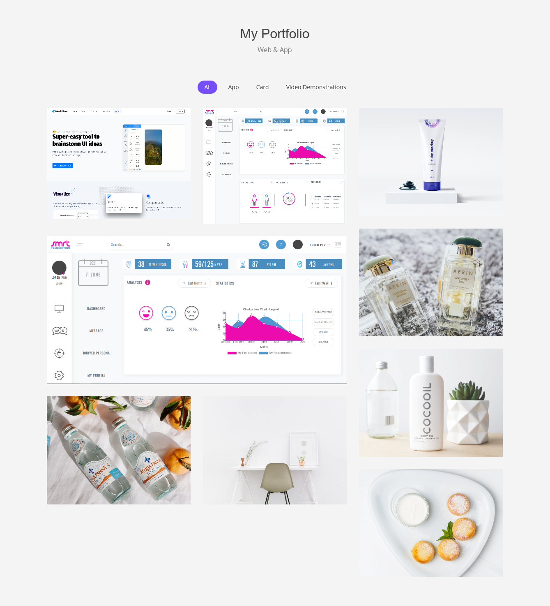
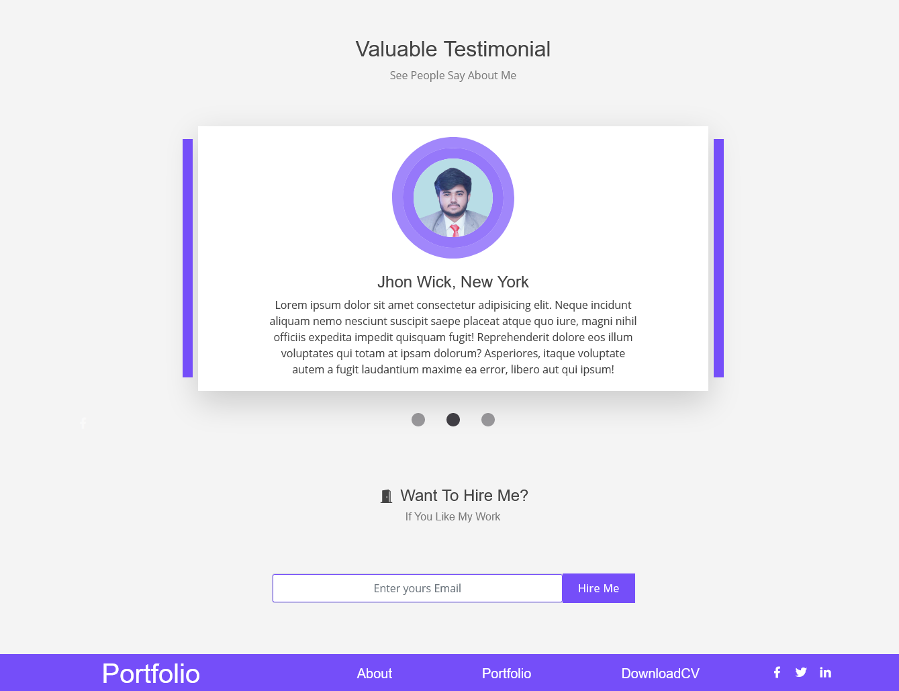
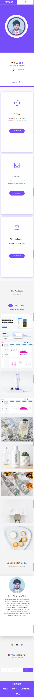
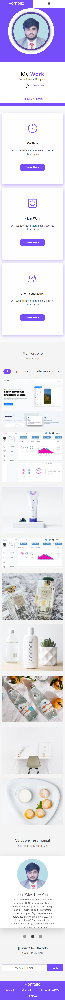
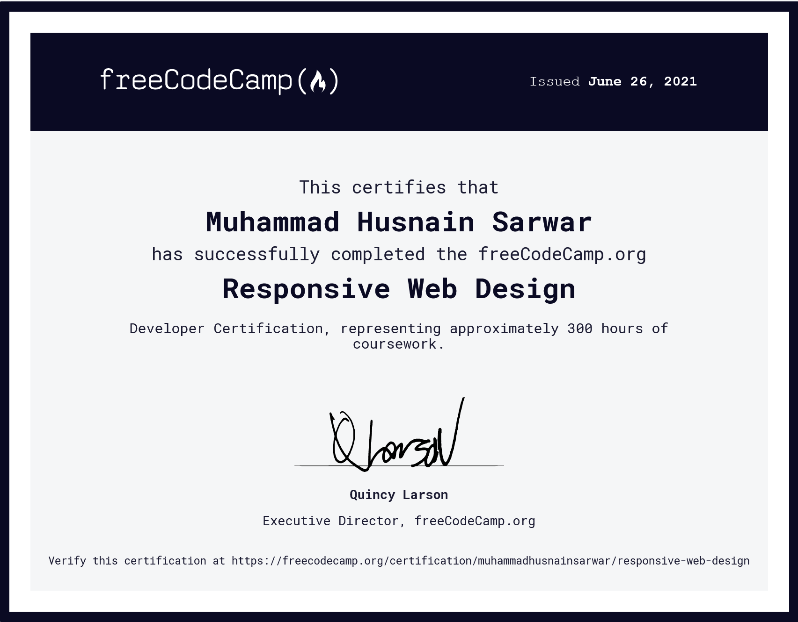

# My Portfolio 
## _---"Develping"---_

# Intro:
 **My Portfolio** I make a pixel perfect Web Page from PSD Conversion.
I make a **My Portfolio** using HTML 5, CSS 3, Bootstrap 5, JavaScript and jQuery. In this project I use approximately all things that are advanced and are using in now a days. 

# Project:
The project is about Creativity. In this project, I make a fully responsive and Cross Browser Compatibile have the following thigs
•	HTML 5
•	CSS 3
•	BOOTSTRAP 5
•	JAVASCRPIT 
•	JQUERY
•	JS VENDORS
•	JS CHARTS
•	JS GRAPGHS

# Pixel Perfect:
I try to made it pixel perfect conversion of PSD to HTML 5 page so I also made a hard affects work also I am working on it. I do QA of that page own my self.

# Learning:
I learn lot a things in this project such as pixel perfect conversion and conversion from PSD to HTML 5 and I also learn Bootstrap 5. How we use js plugins in  our html page .also a lot of things that I learn. 

Vision:
## _---"Great Vision leads humans to humanity"---_

AS I have vision to become a **Software Engineer** and create a revolution in the world of programming. I learn technology on daily basis. I am now a part of Google developers Community in Pakistan in Superior University Gold Campus.

## Some Snap Shots 

| Plugin | README |
| ------ | ------ |
| Desktop |  |
| Desktop |  |
| Desktop |  |
| Desktop |  |
| Mobile |  |
| Tablet |  |

# Free Code Camp Certificate:

| Plugin | README |
| ------ | ------ |
| Achievement |  |

## Video Link:
[Video Demonstration ](https://youtu.be/UN-dwn33Ydo)

## License
[MIT](https://choosealicense.com/licenses/mit/)

